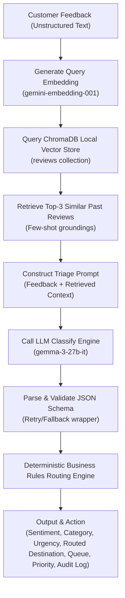

# Feedback RAG & Triage Agent

A retrieval-augmented Q&A system and an autonomous triage agent for customer feedback. Runs entirely on the Google Gemini free tier with rate-limit handling, JSON schema validation, and local persistent storage.

Live demo: [https://eternity-feedback.streamlit.app](https://eternity-feedback.streamlit.app)

---

## What It Does

This repo combines two related pipelines:

*   **RAG Q&A Pipeline**: Accepts natural-language questions about product experiences and generates multi-point, cited answers sourced exclusively from a vector database of 850 Amazon Fine Food Reviews.
*   **Triage Agent**: Automatically processes incoming, unstructured customer feedback. The agent retrieves contextually similar past reviews, classifies the item using structured few-shot grounding, applies deterministic routing rules, and outputs routed tickets to target team queues with audit logging.

---

## System Architecture

The following diagram illustrates how customer feedback traverses the semantic retrieval, LLM classification, and deterministic routing layers:



---

## Why This Design?

Every architectural decision was chosen to prioritize reliability, auditability, and zero-cost replication:

*   **Zero-Cost Free Tier Stack**: The free tier is genuinely free and forces honest rate-limit handling (sleeps, exponential backoff) rather than assuming infinite throughput.
*   **Local ChromaDB Vector DB**: Using a local SQLite-backed ChromaDB instance ensures reproducible retrieval environments without subscription costs or external network dependencies.
*   **Structured Classification via Gemma**: I used `gemma-3-27b-it` for classification because it reliably follows strict JSON output schemas under few-shot prompting.
*   **Retrieval-Augmented Classification**: Instead of asking the model to classify in a vacuum, retrieving similar past items and providing them as context grounds the classification. This few-shot grounding improves classification consistency.
*   **Deterministic Business Rules**: While LLMs excel at understanding natural language (classification), they are poor at consistently applying strict boolean rules. I separated these tasks: the LLM classifies the feedback parameters, and a pure Python routing engine deterministically maps those parameters to teams, queues, and priority scores.
*   **JSON Schema Validation with Fallback**: Unstructured outputs fail. The triage engine uses a multi-layered parser: it strips markdown backticks, parses the raw JSON, retries exactly once with a stricter formatting directive on failure, and falls back to a safe default configuration to guarantee the pipeline never crashes.

---

## Tech Stack

| Layer | Technology | Version / Specifics |
| --- | --- | --- |
| **Generation (LLM)** | Google Gemma | `gemma-3-27b-it` (via Google GenAI SDK) |
| **Embeddings** | Google Gemini | `gemini-embedding-001` (3072 dimensions) |
| **Vector Database** | ChromaDB | Local Persistent SQLite Client (Cosine space) |
| **Application Layer**| Streamlit | Multi-tab interactive UI |
| **Data Science** | pandas / tqdm | Batch preprocessing, analytical filtering, and progress tracking |
| **Development** | Python 3.12 | Standard runtime environment |

---

## Repository Structure

```
feedback-rag/
├── agent/                      # Triage Agent Module
│   ├── __init__.py            # Package initialization
│   ├── prompts.py             # Classification prompts & routing rules reference
│   ├── retrieve.py            # ChromaDB semantic search & few-shot context retrieval
│   ├── classify.py            # Gemma LLM classification & JSON schema validator
│   ├── route.py               # Pure Python routing rule engine
│   ├── run.py                 # Resume-safe batch processor & logger
│   └── outputs/               # Triage outputs & audit files
│       ├── decisions.log      # Granular decision log with timestamps & examples
│       └── triaged_results.csv# Batch execution results dataset
├── chroma_db/                  # SQLite-backed local persistent vector database
├── data/                      # Raw datasets
│   ├── reviews.csv            # Subset of 850 Amazon Fine Food Reviews
│   └── triage_feedbacks.csv   # 30 synthetic test customer feedbacks
├── evals/                      # RAG Q&A Pipeline Evaluation
│   ├── eval_set.json          # Curated test questions & expected responses
│   ├── results.json           # Evaluation metrics & generated responses
│   └── run_eval.py            # Automated eval runner with backoff limits
├── src/                        # Core RAG Application Code
│   ├── __init__.py            # Source directory initialization
│   ├── generate.py            # Answer generator interface using Gemma
│   ├── ingest.py              # Ingests Amazon reviews & synthetic feedbacks
│   ├── rag.py                 # RAG orchestrator linking retrieval to generation
│   └── retrieve.py            # Semantic retrieval client using Gemini embeddings
├── .env                       # Local secrets configuration (ignored in git)
├── .env.example               # Example configurations template
├── .gitignore                 # Excludes caches, venvs, and local DBs
├── app.py                     # Multi-tab Streamlit dashboard interface
└── requirements.txt           # Python package dependencies
```

---

## Setup & Run

### 1. Clone the Repository
```bash
git clone https://github.com/Eternity2401/feedback-rag.git
cd feedback-rag
```

### 2. Configure Virtual Environment
Create and activate the Python virtual environment:

**Windows**:
```bash
python -m venv .venv
.venv\Scripts\activate
```

**Linux/macOS**:
```bash
python3 -m venv .venv
source .venv/bin/activate
```

### 3. Install Dependencies
```bash
pip install -r requirements.txt
```

### 4. Configure Secrets
Copy the environment variables template and configure your Google API Key:
```bash
cp .env.example .env
```
Open `.env` and assign your key:
```env
GOOGLE_API_KEY=your_actual_gemini_api_key_here
```

### 5. Launch the Streamlit App
Run the multi-tab interactive dashboard:
```bash
streamlit run app.py
```

### 6. Run the Batch Triage Pipeline (Optional)
Run the batch triage orchestrator to process all 30 customer feedbacks and write logs:
```bash
python -m agent.run
```

---

## RAG Q&A Deep Dive & Evaluation

The Q&A pipeline performs a semantic vector search of product reviews using cosine similarity to answer user questions with cited, factual summaries.

### Curated Sample Queries
Below are actual outputs showcasing the system's ability to synthesize raw reviews:

#### Question: *Are the chips usually crushed upon arrival?*
> Experiences vary among reviewers:
> 
> * Some report that the chips arrive damaged, with one reviewer stating "most of the chips were broken" (Review 1) and another noting that "some bags end up as crumbs" (Review 3).
> * Others report they arrive in good condition, stating "All the chips are as they should be" (Review 2), "Chips are never crushed or broken" (Review 4), and that they "came packaged perfectly" (Review 5).

#### Question: *Is this product gluten-free?*
> Yes, the product is gluten-free. Reviewers state that they buy the product "because they are gluten free" (Review 1), describe it as "Gluten Free Oatmeal" (Review 2), call them "my favorite gluten-free dairy-free flavored chips" (Review 3), note it is "Great for Gluten-free lifestyle!!" (Review 4), and mention "It's also nice to have something gluten-free for friends" (Review 5).

### Automated Evaluation Suite
The RAG pipeline is actively tested via `evals/run_eval.py` on a set of 20 challenging questions:
*   **Accuracy (Average Score)**: 39%
*   **Average Score by Category**:
    *   *Comparison*: 47%
    *   *Complaint*: 49%
    *   *Sentiment*: 36%
    *   *Information*: 29%
*   **Rate-limit Failures**: 0/20 (bypassed entirely using the exponential retry logic)
*   **Punts ("I don't know" answers)**: 3 (representing robust containment where the 850 reviews lack the answer)

---

## Triage Agent Module — Deep Dive

The triage module ingests raw customer support tickets, extracts structured attributes, and routes them to appropriate teams.

### 1. Classification Schema
Gemma generates a structured JSON object containing:
*   `sentiment`: `"positive" | "negative" | "neutral" | "mixed"`
*   `category`: `"bug" | "feature_request" | "praise" | "complaint" | "billing" | "spam" | "other"`
*   `urgency`: `"critical" | "high" | "medium" | "low"`
*   `recommended_team`: `"engineering" | "product" | "support" | "billing" | "marketing" | "trash"`
*   `reasoning`: A 1-2 sentence justification.

### 2. Business Routing Rules

The routing engine executes the following logic mapping:

| Category | Urgency | Target Team (Destination) | Assigned Queue | Priority Score |
| --- | --- | --- | --- | --- |
| **bug** | critical | engineering | P0 | 10 |
| **bug** | high | engineering | P1 | 7 |
| **bug** | medium / low | engineering | P2 | 5 or 3 |
| **billing** | *any* | billing | refunds | Urgency-dependent |
| **feature_request** | *any* | product | backlog | Urgency-dependent |
| **praise** | *any* | marketing | wins_board | Urgency-dependent |
| **complaint** | critical / high | support | priority | 10 or 7 |
| **complaint** | medium / low | support | normal | 5 or 3 |
| **spam** | *any* | trash | trash | 0 |

### 3. Sample Execution Output

The table below shows sample data generated in `agent/outputs/triaged_results.csv` from a run:

| ID | Text | Category | Urgency | Destination | Queue | Priority | Reasoning |
| --- | --- | --- | --- | --- | --- | --- | --- |
| **1** | App crashes every time I open it on Android 14. Lost all my data... | bug | critical | engineering | P0 | 10 | The user reports app crashes on Android 14 resulting in data loss, which is highly critical. |
| **2** | Would love a dark mode option for the dashboard, especially... | feature_request | low | product | backlog | 3 | The customer requests a dark mode feature, which represents a non-urgent product enhancement. |
| **3** | Just got my order in 2 days. Packaging was perfect and product... | praise | low | marketing | wins_board | 3 | Customer is highly satisfied with fast shipping and packaging quality, representing excellent feedback. |

### 4. Rate-Limit & Free-Tier Compliance
To safely process batch requests under the strict free tier, I built the following guardrails:
*   **Embeddings Spacing**: `time.sleep(13)` before each embedding query to stay below the 5 RPM ceiling.
*   **Generation Spacing**: `time.sleep(4)` before each LLM call to stay below the 15 RPM ceiling.
*   **Resume Safety**: The batch orchestrator records completed entries to `agent/outputs/triaged_results.csv` progressively. If interrupted, restarting the script automatically reads existing entries and processes only the remainder.

---

## Execution Performance & Metrics

I executed a complete batch triage run over the 30 synthetic feedbacks:
*   **Total Feedbacks Processed**: 30
*   **Successful Runs**: 30
*   **Failed Runs**: 0 (100% completion rate)
*   **Category Distribution**:
    *   `bug`: 7
    *   `feature_request`: 6
    *   `praise`: 6
    *   `billing`: 5
    *   `complaint`: 4
    *   `other`: 1
    *   `spam`: 1
*   **Destination Distribution**:
    *   `engineering`: 7
    *   `product`: 7
    *   `marketing`: 6
    *   `billing`: 5
    *   `support`: 4
    *   `trash`: 1
*   **Total Execution Runtime**: ~19 minutes (safely paced for free-tier rate limits)
*   **Total Cost**: $0.00

---

## Future Improvements

If I had more time, I would expand this architecture in the following directions:

1.  **Human-in-the-Loop Active Learning**: Add a pipeline where agents can flag classifications that were manually corrected by support staff and append them back into ChromaDB to act as improved few-shot context examples.
2.  **Multi-Language Translation Pre-step**: Ingest feedback in any language (e.g. Hindi, Spanish, Mandarin) and route it through a lightweight translator before semantic search and classification.
3.  **Real-Time Integrations**: Create Slack/Teams webhooks to post critically-rated bugs directly to developer alerts channels or stream wins to marketing boards.
4.  **Confidence-Based Throttling**: Generate a confidence score during classification. If the score is low (e.g., < 0.7), flag the item for manual review before applying routing.
5.  **Multi-Query Retrieval Expansion**: Use query expansion to generate synonyms or sub-queries for incoming customer feedback to surface context reviews more accurately.
6.  **Migrate to Managed Vector DB**: As volume increases past 100k records, swap the local ChromaDB client for a managed vector service (such as Pinecone or Weaviate) to support concurrent scale.

---

## License

MIT
