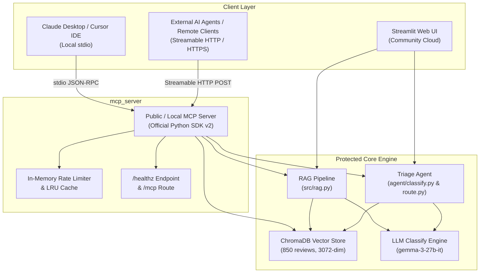

# Feedback RAG & Public MCP-Enabled Agentic System

A retrieval-augmented Q&A system and autonomous triage agent for customer feedback, upgraded with a standardized **Model Context Protocol (MCP)** server. The platform operates entirely on the Google Gemini Free Tier with in-memory rate-limit resilience, JSON schema validation, and dual-mode accessibility (Streamlit Web UI + Public Streamable HTTP MCP Server).

- **Live Streamlit App**: [https://eternity-feedback.streamlit.app](https://eternity-feedback.streamlit.app)
- **Public MCP Server (Streamable HTTP)**: `https://feedback-rag-mcp.onrender.com/mcp`
- **MCP Health Check**: `https://feedback-rag-mcp.onrender.com/healthz`

---

## What It Does

This repository provides three interconnected feedback intelligence flows in one unified codebase:

1. **RAG Q&A Pipeline**: Accepts natural-language questions about product experiences and generates multi-point, cited answers sourced exclusively from a vector database of 850 Amazon Fine Food Reviews.
2. **Autonomous Triage Agent**: Automatically processes incoming, unstructured customer feedback. The agent retrieves contextually similar past reviews, classifies the item using structured few-shot grounding, applies deterministic routing rules, and outputs routed tickets to target team queues with audit logging.
3. **Model Context Protocol (MCP) Server**: Exposes vector search, RAG Q&A, and autonomous triage as standardized MCP tools, resources, and prompts over both local `stdio` and public `Streamable HTTP` transports for seamless integration with Claude Desktop, Cursor IDE, Windsurf, and external autonomous AI agents.

---

## System Architecture

The following diagram illustrates the protocol-driven architecture:


```mermaid
graph TD
    subgraph Client Layer
        A1["Streamlit Web UI<br>(Community Cloud)"]
        A2["Claude Desktop / Cursor IDE<br>(Local stdio)"]
        A3["External AI Agents / Remote Clients<br>(Streamable HTTP / HTTPS)"]
    end

    subgraph MCP Protocol Layer [mcp_server]
        B["Public / Local MCP Server<br>(Official Python SDK v2)"]
        B1["In-Memory Rate Limiter<br>& LRU Cache"]
        B2["/healthz Endpoint<br>& /mcp Route"]
        B --> B1
        B --> B2
    end

    subgraph Protected Core Engine
        C1["RAG Pipeline<br>(src/rag.py)"]
        C2["ChromaDB Vector Store<br>(850 reviews, 3072-dim)"]
        C3["Triage Agent<br>(agent/classify.py & route.py)"]
        C4["LLM Classify Engine<br>(gemma-3-27b-it)"]
    end

    A1 --> C1
    A1 --> C3
    A2 -->|stdio JSON-RPC| B
    A3 -->|Streamable HTTP POST| B
    B --> C1
    B --> C2
    B --> C3
    C1 --> C2
    C1 --> C4
    C3 --> C2
    C3 --> C4
```

---

## Why This Design?

Every architectural decision was chosen to prioritize reliability, auditability, open interoperability, and zero-cost replication:

* **Zero-Cost Free Tier Stack**: The free tier is genuinely free and forces honest rate-limit handling (sleeps, exponential backoff) rather than assuming infinite throughput.
* **Protocol-Driven Interoperability (MCP v2)**: Exposing system capabilities over the open Model Context Protocol decouples our core domain logic from specific frontends, allowing any modern LLM or IDE to discover and invoke our tools programmatically.
* **Local ChromaDB Vector DB**: Using a local SQLite-backed ChromaDB instance ensures reproducible retrieval environments without subscription costs or external network dependencies.
* **Structured Classification via Gemma**: I used `gemma-3-27b-it` for classification because it reliably follows strict JSON output schemas under few-shot prompting.
* **Retrieval-Augmented Classification**: Instead of asking the model to classify in a vacuum, retrieving similar past items and providing them as context grounds the classification. This few-shot grounding improves classification consistency.
* **Deterministic Business Rules**: While LLMs excel at understanding natural language (classification), they are poor at consistently applying strict boolean rules. I separated these tasks: the LLM classifies the feedback parameters, and a pure Python routing engine deterministically maps those parameters to teams, queues, and priority scores.
* **In-Memory Rate Limiting & LRU Caching**: An in-memory sliding-window limiter (15 req/min/IP) and LRU cache at the MCP adapter layer protect the Gemini free tier from abuse without modifying the underlying core modules.

---

## Tech Stack

| Layer | Technology | Version / Specifics |
| --- | --- | --- |
| **Protocol / MCP** | Model Context Protocol | `mcp>=2.0.0` (Official Python SDK v2, `MCPServer`, Streamable HTTP) |
| **Generation (LLM)** | Google Gemma | `gemma-3-27b-it` (via Google GenAI SDK) |
| **Embeddings** | Google Gemini | `gemini-embedding-001` (3072 dimensions) |
| **Vector Database** | ChromaDB | Local Persistent SQLite Client (Cosine space) |
| **Web UI** | Streamlit | Multi-tab interactive UI (RAG Q&A, Triage, MCP Inspector) |
| **HTTP Server** | Starlette / Uvicorn | ASGI Streamable HTTP server with dynamic host security |
| **Data Science** | pandas / tqdm | Batch preprocessing, analytical filtering, and progress tracking |
| **Development** | Python 3.11+ / 3.12 | Standard runtime environment |

---

## Repository Structure

```
feedback-rag/
├── agent/                      # Triage Agent Module
│   ├── __init__.py            # Package initialization
│   ├── prompts.py             # Classification prompts & routing rules reference
│   ├── retrieve.py            # ChromaDB semantic search & few-shot context retrieval
│   ├── classify.py            # Gemma LLM classification & JSON schema validator
│   ├── route.py               # Pure Python routing rule engine
│   ├── run.py                 # Resume-safe batch processor & logger
│   └── outputs/               # Triage outputs & audit files
│       ├── decisions.log      # Granular decision log with timestamps & examples
│       └── triaged_results.csv# Batch execution results dataset
├── chroma_db/                  # SQLite-backed local persistent vector database
├── data/                      # Raw datasets
│   ├── reviews.csv            # Subset of 850 Amazon Fine Food Reviews
│   └── triage_feedbacks.csv   # 30 synthetic test customer feedbacks
├── evals/                      # RAG Q&A Pipeline Evaluation
│   ├── eval_set.json          # Curated test questions & expected responses
│   ├── results.json           # Evaluation metrics & generated responses
│   └── run_eval.py            # Automated eval runner with backoff limits
├── mcp_server/                 # Model Context Protocol (MCP) Server Module
│   ├── __init__.py            # MCP package initialization
│   ├── schemas.py             # Pydantic structured response schemas
│   ├── rate_limiter.py        # In-memory sliding-window rate limiter & LRU cache
│   ├── server.py              # Core MCP server definition (Tools, Resources, Prompts)
│   ├── http_server.py         # Streamable HTTP ASGI application for cloud deployment
│   └── client_test.py         # Automated protocol handshake & tool test suite
├── src/                        # Core RAG Application Code
│   ├── __init__.py            # Source directory initialization
│   ├── generate.py            # Answer generator interface using Gemma
│   ├── ingest.py              # Ingests Amazon reviews & synthetic feedbacks
│   ├── rag.py                 # RAG orchestrator linking retrieval to generation
│   └── retrieve.py            # Semantic retrieval client using Gemini embeddings
├── .env                       # Local secrets configuration (ignored in git)
├── .env.example               # Example configurations template
├── .gitignore                 # Excludes caches, venvs, and local DBs
├── app.py                     # 3-Tab Streamlit dashboard interface
├── render.yaml                # Zero-cost Render Free Web Service deployment spec
├── requirements.txt           # Main dependencies
└── requirements-mcp.txt       # MCP deployment dependencies
```

---

## Model Context Protocol (MCP) Deep Dive

The MCP integration exposes four callable tools, two inspection resources, and one prompt template.

### 1. Registered MCP Tools

| Tool Name | Parameters | Description | Return Format |
| :--- | :--- | :--- | :--- |
| **`query_reviews_rag`** | `question: str`, `top_k: int = 5` | Performs natural-language RAG answering with citations from 850 Amazon reviews. | `{"success": true, "question": "...", "answer": "...", "sources": [...]}` |
| **`semantic_search_reviews`** | `query: str`, `k: int = 3` | Performs raw cosine vector search against ChromaDB without calling the LLM generator. | `{"success": true, "query": "...", "results": [{"text": "...", "distance": 0.12}]}` |
| **`triage_customer_feedback`** | `feedback_text: str` | Executes full triage: retrieval $\rightarrow$ Gemma classification $\rightarrow$ deterministic routing. | `{"success": true, "sentiment": "...", "category": "...", "destination": "...", "priority_score": 10}` |
| **`get_triage_batch_metrics`** | *none (read-only)* | Returns analytical breakdown of category, urgency, queue, and average priority score from past runs. | `{"success": true, "total_feedback": 30, "category_distribution": {...}}` |

### 2. Registered MCP Resources

* **`reviews://dataset-summary`**: Returns JSON metadata for the ChromaDB collection (850 reviews, 3072 dimensions, cosine space, field definitions).
* **`triage://queues`**: Returns JSON definitions of all team queues (`engineering: [P0, P1, P2]`, `billing: [refunds]`, `product: [backlog]`, `marketing: [wins_board]`, `support: [priority, normal]`, `trash: [trash]`).

### 3. Registered MCP Prompt

* **`feedback_triage_prompt`**: Standardized prompt template for external clients to invoke few-shot feedback classification.

---

## Client Integration Guide

### A. Claude Desktop (Local stdio)
Add the server configuration to your `claude_desktop_config.json`:

```json
{
  "mcpServers": {
    "feedback-rag": {
      "command": "python",
      "args": ["-m", "mcp_server.server"],
      "cwd": "C:/path/to/feedback-rag"
    }
  }
}
```

### B. Cursor IDE / Remote MCP Clients (Streamable HTTP)
Add the public endpoint to your Cursor `.cursor/mcp.json` or remote MCP client:

```json
{
  "mcpServers": {
    "feedback-rag": {
      "url": "https://feedback-rag-mcp.onrender.com/mcp",
      "transport": "streamable-http"
    }
  }
}
```

---

## Setup & Run

### 1. Clone & Setup Environment
```bash
git clone https://github.com/Eternity2401/feedback-rag.git
cd feedback-rag

python -m venv .venv
# Windows:
.venv\Scripts\activate
# Linux/macOS:
source .venv/bin/activate

pip install -r requirements.txt
```

### 2. Configure Secrets
Copy the environment variables template and add your Google API Key:
```bash
cp .env.example .env
```
Edit `.env`:
```env
GOOGLE_API_KEY=your_actual_gemini_api_key_here
```

### 3. Verify MCP Protocol Handshake
Run the automated MCP client test suite over stdio:
```bash
python -m mcp_server.client_test
```
*Expected: Connects, discovers 4 tools, 2 resources, 1 prompt, and executes tool calls successfully.*

### 4. Launch Streamlit Web UI
Run the multi-tab interactive dashboard:
```bash
streamlit run app.py
```
- **Tab 1**: 🛒 Ask Reviews (Grounded Q&A)
- **Tab 2**: 🤖 Triage Agent (Interactive feedback classification)
- **Tab 3**: 🔌 MCP Server & Protocol (Live tool tester & client configs)

### 5. Run Public MCP Server Locally
```bash
python -m mcp_server.http_server
# or
uvicorn mcp_server.http_server:app --host 0.0.0.0 --port 8000
```
Health check: `http://localhost:8000/healthz`  
MCP endpoint: `http://localhost:8000/mcp`

---

## RAG Q&A Deep Dive & Evaluation

The Q&A pipeline performs a semantic vector search of product reviews using cosine similarity to answer user questions with cited, factual summaries.

### Curated Sample Queries

#### Question: *Are the chips usually crushed upon arrival?*
> Experiences vary among reviewers:
> 
> * Some report that the chips arrive damaged, with one reviewer stating "most of the chips were broken" (Review 1) and another noting that "some bags end up as crumbs" (Review 3).
> * Others report they arrive in good condition, stating "All the chips are as they should be" (Review 2), "Chips are never crushed or broken" (Review 4), and that they "came packaged perfectly" (Review 5).

#### Question: *Is this product gluten-free?*
> Yes, the product is gluten-free. Reviewers state that they buy the product "because they are gluten free" (Review 1), describe it as "Gluten Free Oatmeal" (Review 2), call them "my favorite gluten-free dairy-free flavored chips" (Review 3), note it is "Great for Gluten-free lifestyle!!" (Review 4), and mention "It's also nice to have something gluten-free for friends" (Review 5).

### Automated Evaluation Suite
The RAG pipeline is actively tested via `evals/run_eval.py` on a set of 20 challenging questions:
* **Accuracy (Average Score)**: 39%
* **Average Score by Category**:
  * *Comparison*: 47%
  * *Complaint*: 49%
  * *Sentiment*: 36%
  * *Information*: 29%
* **Rate-limit Failures**: 0/20 (bypassed entirely using exponential retry logic)
* **Punts ("I don't know" answers)**: 3 (representing robust containment where the 850 reviews lack the answer)

---

## Triage Agent Module — Deep Dive

### 1. Classification Schema
Gemma generates a structured JSON object containing:
* `sentiment`: `"positive" | "negative" | "neutral" | "mixed"`
* `category`: `"bug" | "feature_request" | "praise" | "complaint" | "billing" | "spam" | "other"`
* `urgency`: `"critical" | "high" | "medium" | "low"`
* `recommended_team`: `"engineering" | "product" | "support" | "billing" | "marketing" | "trash"`
* `reasoning`: A 1-2 sentence justification.

### 2. Business Routing Rules

| Category | Urgency | Target Team (Destination) | Assigned Queue | Priority Score |
| --- | --- | --- | --- | --- |
| **bug** | critical | engineering | P0 | 10 |
| **bug** | high | engineering | P1 | 7 |
| **bug** | medium / low | engineering | P2 | 5 or 3 |
| **billing** | *any* | billing | refunds | Urgency-dependent |
| **feature_request** | *any* | product | backlog | Urgency-dependent |
| **praise** | *any* | marketing | wins_board | Urgency-dependent |
| **complaint** | critical / high | support | priority | 10 or 7 |
| **complaint** | medium / low | support | normal | 5 or 3 |
| **spam** | *any* | trash | trash | 0 |

### 3. Sample Execution Output

| ID | Text | Category | Urgency | Destination | Queue | Priority | Reasoning |
| --- | --- | --- | --- | --- | --- | --- | --- |
| **1** | App crashes every time I open it on Android 14. Lost all my data... | bug | critical | engineering | P0 | 10 | The user reports app crashes on Android 14 resulting in data loss, which is highly critical. |
| **2** | Would love a dark mode option for the dashboard, especially... | feature_request | low | product | backlog | 3 | The customer requests a dark mode feature, which represents a non-urgent product enhancement. |
| **3** | Just got my order in 2 days. Packaging was perfect and product... | praise | low | marketing | wins_board | 3 | Customer is highly satisfied with fast shipping and packaging quality, representing excellent feedback. |

---

## Public Deployment & Free-Tier Limitations

* **Streamlit Community Cloud**: Automatically builds and hosts the user-facing web dashboard directly from the main branch.
* **Render Free Web Service**: Hosts the stateless Streamable HTTP MCP server at zero cost via `render.yaml`.
* **Cold Starts**: Render free services spin down after 15 minutes of inactivity. The initial MCP request may experience a ~30-second cold-start delay while the instance boots.
* **Security**: Google Gemini API keys remain strictly server-side and are never exposed over MCP or client responses.

---

## License

MIT
